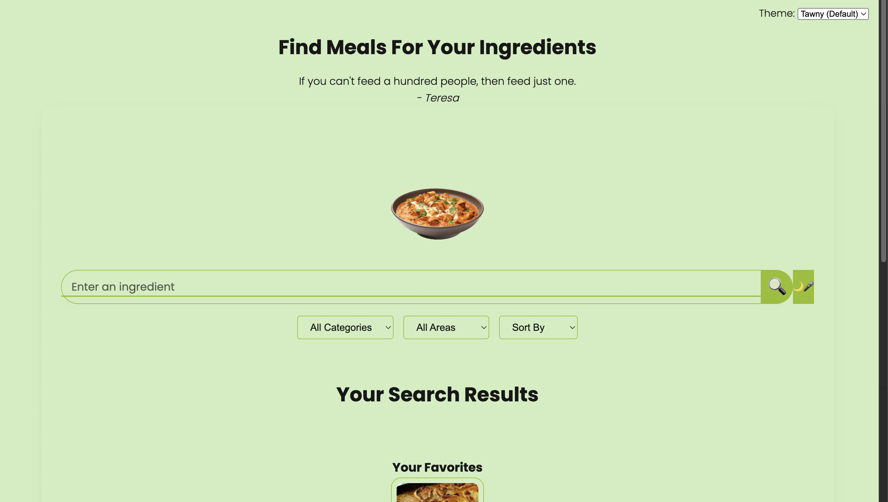
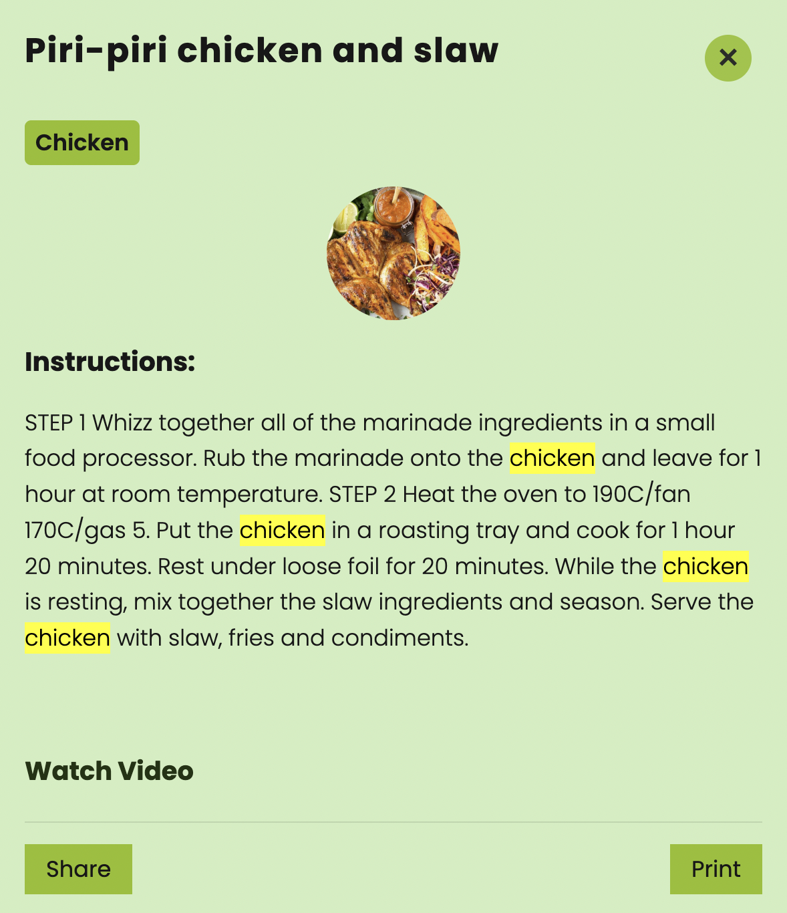

# 🍽️ Meal Finder Web App

A responsive and feature-rich web application that helps users **find meals by ingredients** using the [TheMealDB API](https://www.themealdb.com/).  
With built-in recipe details, weekly meal planning, favorites, and a shopping list generator, it makes cooking fun and organized.

---

## ✨ Features

- 🔍 **Smart Search & Suggestions** – Find meals by entering ingredients.  
- 🗂️ **Filters & Sorting** – Filter meals by category and area, sort alphabetically.  
- 📖 **Detailed Recipes** – View instructions, category, and YouTube video guides.  
- ⭐ **Favorites Manager** – Save and manage favorite recipes.  
- 📅 **Weekly Meal Planner** – Add meals to specific days of the week.  
- 🛒 **Shopping List Generator** – Automatically generate ingredient lists.  
- 🌙 **Dark Mode & Multiple Themes** – Customize the look and feel.  
- 🎤 **Voice Search** – Search meals using voice input.  
- 🎬 **Fun Animations** – Interactive chicken, cow, and curry animations.  

---

## 🖼️ Screenshots

| Home | Search Results | Recipe Details |
|------|----------------|----------------|
|  |  |  |

 

---

## Built With

- **HTML5** – Page structure  
- **CSS3** – Styling, responsive design, dark mode, and themes  
- **JavaScript (ES6)** – Functionality, localStorage, API calls  
- **TheMealDB API** – Meal and recipe database  

---

## Getting Started

### 1. Clone the repository
```bash
git clone https://github.com/SarwarAhmedEmran/Meal-Finder-Web-App.git
cd "Meal Finder Web App"
# Meal-Finder-Web-App
🍽️ Meal Finder App – Search meals by ingredients, explore recipes, save favorites, plan weekly meals, and generate shopping lists. Built with HTML, CSS, and JavaScript using TheMealDB API.


Project Structure
Meal Finder Web App/
│
├── index.html        # Main HTML file
├── style.css         # Styles and themes
├── script.js         # Functionality and API logic
├── images/           # Images (chicken, cow, curry, screenshots)
└── README.md         # Project documentation

Contributing

Contributions, issues, and feature requests are welcome!
Feel free to fork this repository and submit a pull request.

Acknowledgments

TheMealDB API
 for providing free meal data

Font Awesome
 for icons

Inspiration from recipe finder applications

Author

Sarwar Ahmed Emran
🔗 GitHub: SarwarAhmedEmran
